# System Architecture - Open Deep Research Agent

## 목차
1. [시스템 개요](#시스템-개요)
2. [전체 아키텍처](#전체-아키텍처)
3. [컴포넌트 구성](#컴포넌트-구성)
4. [데이터 플로우](#데이터-플로우)
5. [워크플로우 상세](#워크플로우-상세)
6. [기술 스택](#기술-스택)
7. [배포 아키텍처](#배포-아키텍처)

## 시스템 개요

Open Deep Research Agent는 LangGraph 기반의 AI 연구 에이전트로, 복잡한 연구 질문에 대해 단계별 분석과 종합을 수행합니다.

### 주요 특징
- 🤖 **Ollama 통합**: 로컬 LLM을 활용한 프라이버시 보장 (Gemma 3:4B/12B)
- 🔄 **LangGraph 워크플로우**: 체계적인 연구 프로세스 자동화
- 🌐 **다국어 지원**: 한국어, 영어 자동 감지 및 응답
- ⚡ **실시간 진행상황**: WebSocket/Socket.IO를 통한 세부 진행률 업데이트
- 💾 **세션 지속성**: SQLite 기반 연구 세션 저장 및 재개
- 🔍 **Tavily 검색**: 웹 검색을 통한 최신 정보 수집
- 🔄 **원격 접속**: 네트워크 내 여러 디바이스에서 접속 가능

## 전체 아키텍처

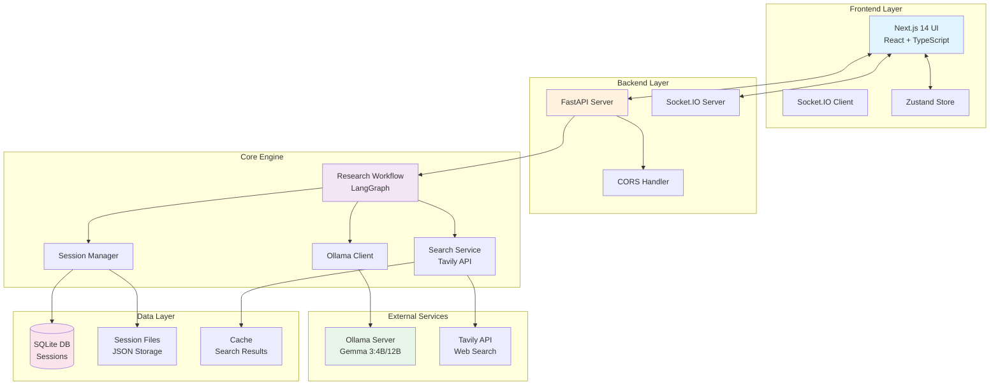

## 컴포넌트 구성

### Frontend Components

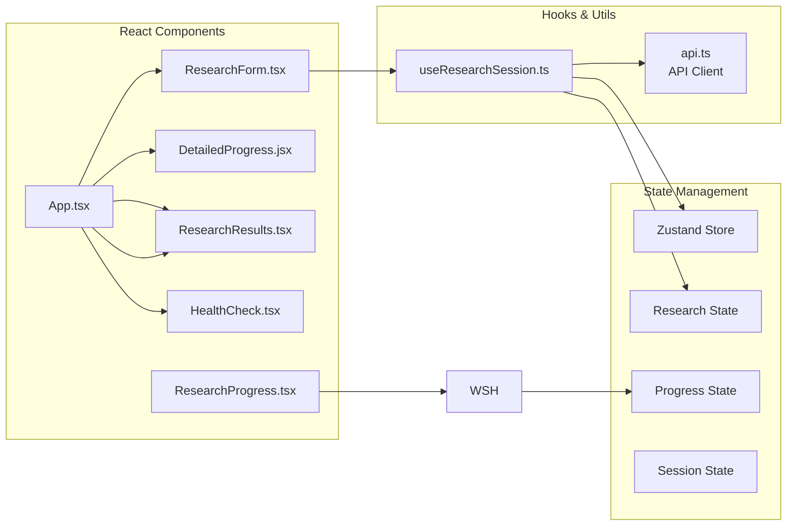

### Backend Architecture

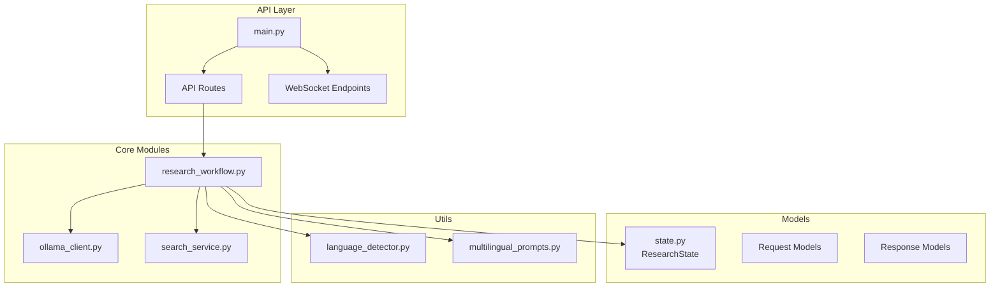

## 데이터 플로우

### Research Request Flow

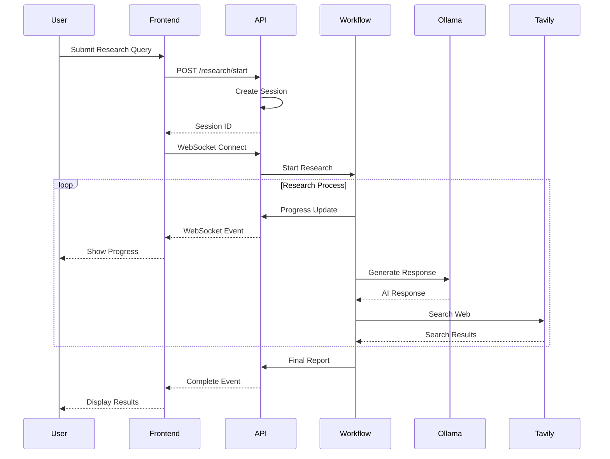

## 워크플로우 상세

### LangGraph Research Workflow

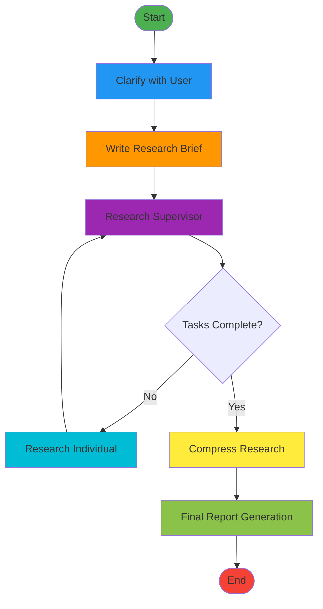

### State Management

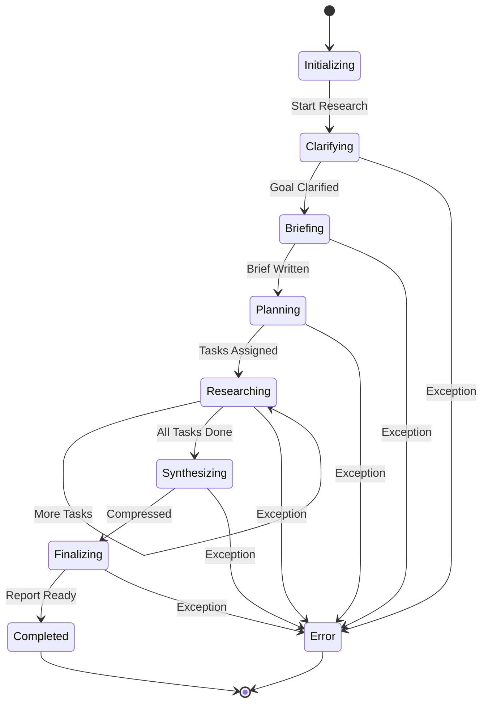

## 기술 스택

### Backend Stack
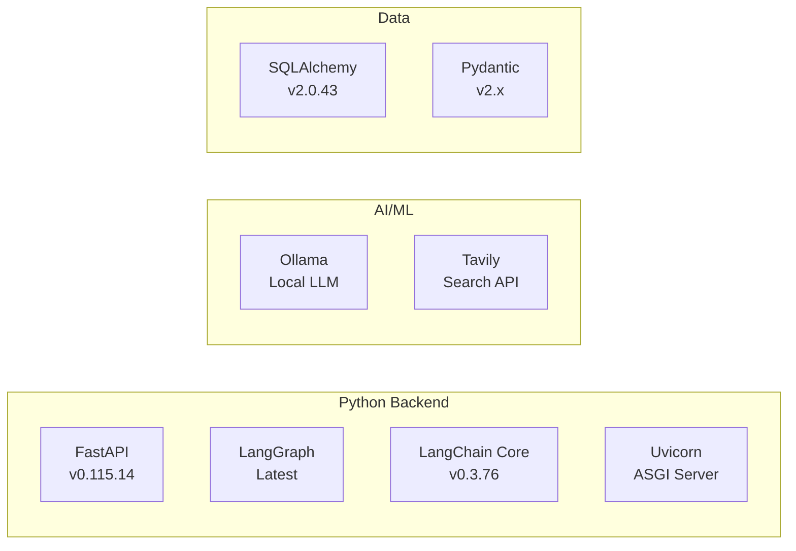

### Frontend Stack
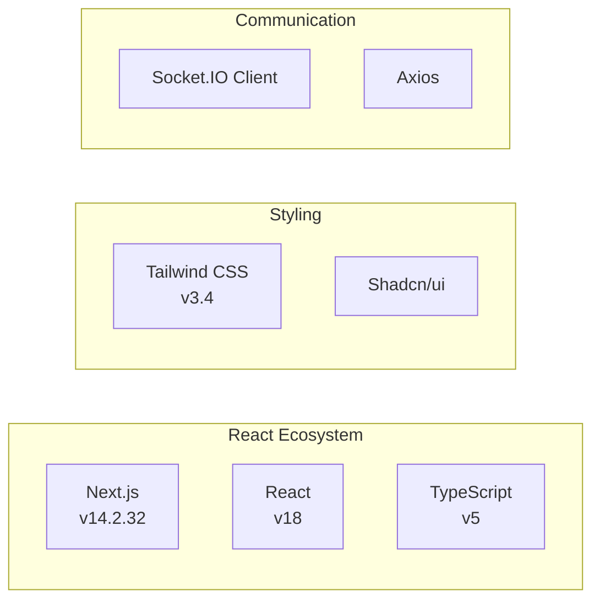

## 배포 아키텍처

### Docker Deployment

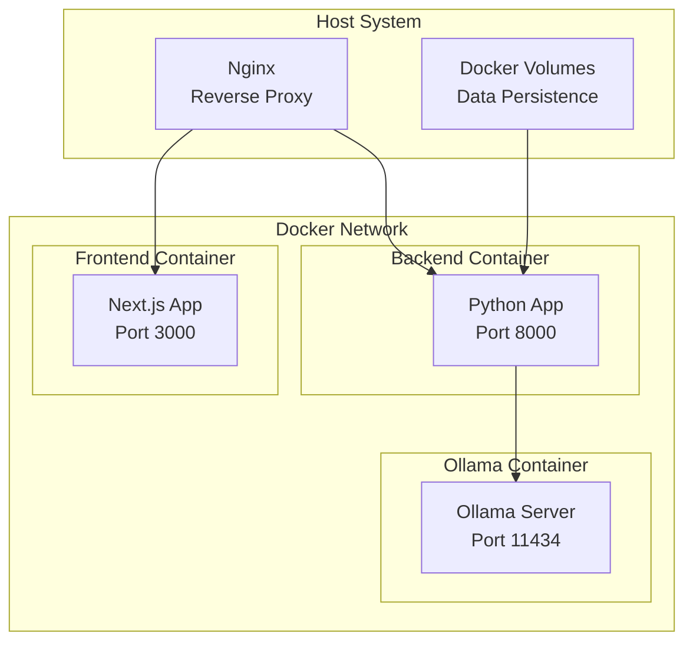

### Environment Configuration

```yaml
Services:
  Backend:
    - Port: 8000
    - Environment:
      - OLLAMA_BASE_URL
      - TAVILY_API_KEY
      - DATABASE_URL
  
  Frontend:
    - Port: 3000
    - Environment:
      - NEXT_PUBLIC_API_URL
      - NEXT_PUBLIC_WS_URL
  
  Ollama:
    - Port: 11434
    - Models:
      - gemma3:12b
      - qwen3:8b
      - gemma3:4b
```

## Security Considerations

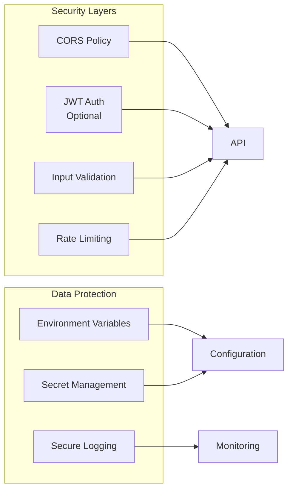

## Performance Optimization

### Caching Strategy
- Search results: 15분 캐시
- LLM responses: Session-based 캐시
- Static assets: CDN 캐싱

### Scaling Options
1. **Horizontal Scaling**: Multiple API instances
2. **Load Balancing**: Nginx/HAProxy
3. **Queue System**: Celery for async tasks
4. **Database**: PostgreSQL for production

## Monitoring & Logging

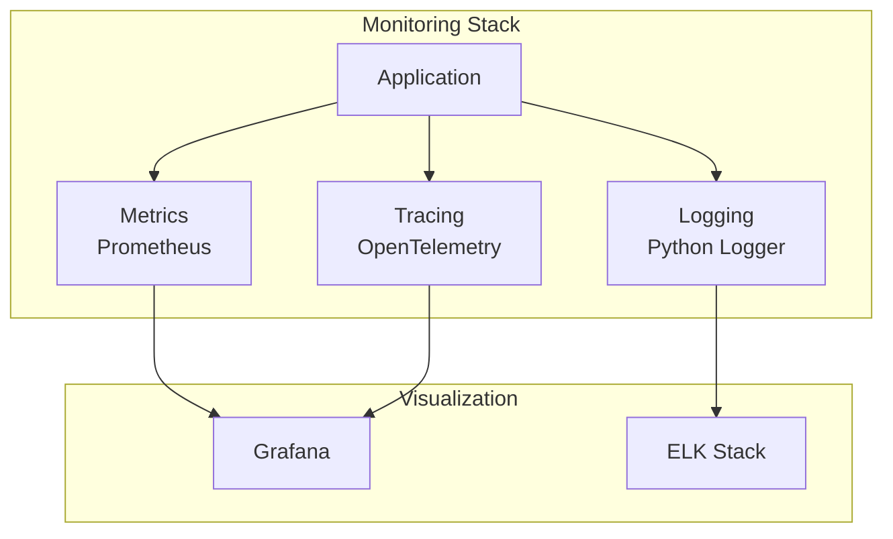

## Future Enhancements

1. **Multi-Agent Collaboration**: 여러 연구원 에이전트 협업
2. **Knowledge Graph**: 연구 결과 지식 그래프 구축
3. **Custom Models**: 도메인별 특화 모델 지원
4. **Real-time Collaboration**: 실시간 협업 기능
5. **Export Options**: PDF, Markdown, Word 내보내기

---

*Last Updated: 2025-09-13*