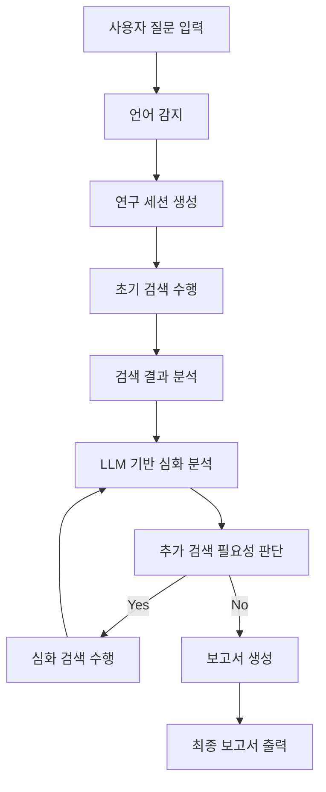

# Deep Research Agent - 상세 데이터 흐름 분석

## 1. 전체 데이터 흐름 개요



## 2. 단계별 상세 데이터 흐름

### 2.1 사용자 입력 처리
```json
// Frontend → Backend
{
  "query": "AI 기술의 최신 동향",
  "language": "auto", // 자동감지 또는 ko/en
  "options": {
    "depth": "deep", // shallow, medium, deep
    "sources": ["web", "academic", "news"]
  }
}
```

### 2.2 언어 감지 및 세션 생성
```python
# Backend 처리 과정
def process_research_request(request):
    # 1. 언어 감지
    detected_lang = language_detector.detect(request.query)
    
    # 2. 연구 세션 생성
    session = ResearchSession(
        id=uuid4(),
        query=request.query,
        language=detected_lang,
        status="initializing"
    )
    
    # 3. 실시간 상태 업데이트
    websocket.emit("status_update", {
        "session_id": session.id,
        "status": "언어 감지 완료",
        "progress": 10
    })
```

### 2.3 다중 소스 검색 단계
```python
# 검색 서비스별 데이터 흐름
async def perform_multi_source_search(query: str, language: str):
    search_tasks = [
        tavily_search(query),           # 일반 웹 검색
        academic_search(query),         # 학술 자료 검색
        news_search(query),            # 뉴스 검색
        wikipedia_search(query)        # 위키피디아 검색
    ]
    
    # 병렬 검색 수행
    results = await asyncio.gather(*search_tasks)
    
    # 검색 결과 통합 및 필터링
    filtered_results = filter_and_rank_results(results)
    
    return {
        "sources": filtered_results,
        "total_found": len(filtered_results),
        "search_time": time.time() - start_time
    }
```

### 2.4 LLM 분석 단계의 데이터 흐름
```python
# Ollama와의 상호작용
class ResearchAnalyzer:
    async def analyze_sources(self, sources: List[Source], query: str, lang: str):
        # 1. 소스별 요약 생성
        summaries = []
        for source in sources:
            summary_prompt = self.create_summary_prompt(source.content, lang)
            summary = await self.ollama_client.generate(
                prompt=summary_prompt,
                model="gemma2:12b"
            )
            summaries.append({
                "source_id": source.id,
                "summary": summary,
                "relevance_score": self.calculate_relevance(summary, query)
            })
        
        # 2. 심화 질문 생성
        deep_questions = await self.generate_follow_up_questions(
            query, summaries, lang
        )
        
        return {
            "summaries": summaries,
            "follow_up_questions": deep_questions,
            "analysis_complete": True
        }
```

## 3. 시스템 컴포넌트 간 상호작용

### 3.1 Frontend ↔ Backend 통신
```typescript
// Frontend: 실시간 상태 업데이트 수신
const useResearchProgress = (sessionId: string) => {
  const [progress, setProgress] = useState(0)
  const [status, setStatus] = useState('')
  
  useEffect(() => {
    const socket = io('ws://localhost:8000')
    
    socket.on(`research_${sessionId}`, (data) => {
      setProgress(data.progress)
      setStatus(data.status)
      
      // 단계별 상태 업데이트
      switch(data.stage) {
        case 'searching':
          setStatus('검색 중...')
          break
        case 'analyzing':
          setStatus('분석 중...')
          break
        case 'generating':
          setStatus('보고서 생성 중...')
          break
      }
    })
    
    return () => socket.disconnect()
  }, [sessionId])
  
  return { progress, status }
}
```

### 3.2 Backend ↔ Ollama 통신
```python
# Ollama 클라이언트 상세 구현
class OllamaClient:
    async def stream_generate(self, prompt: str, callback: Callable):
        async with aiohttp.ClientSession() as session:
            async with session.post(
                f"{self.base_url}/api/generate",
                json={
                    "model": "gemma2:12b",
                    "prompt": prompt,
                    "stream": True
                }
            ) as response:
                async for line in response.content:
                    if line:
                        data = json.loads(line)
                        await callback(data.get('response', ''))
                        
                        # 진행 상황을 프론트엔드로 전송
                        await websocket.emit('llm_progress', {
                            'text': data.get('response', ''),
                            'done': data.get('done', False)
                        })
```

## 4. 실시간 통신 패턴

### 4.1 WebSocket 이벤트 구조
```python
# Backend WebSocket 이벤트 관리
class ResearchWebSocketManager:
    def __init__(self):
        self.connections = {}  # session_id -> websocket
    
    async def broadcast_progress(self, session_id: str, data: dict):
        if session_id in self.connections:
            await self.connections[session_id].send_json({
                "type": "progress_update",
                "session_id": session_id,
                "timestamp": datetime.now().isoformat(),
                "data": data
            })
    
    async def broadcast_error(self, session_id: str, error: str):
        await self.broadcast_progress(session_id, {
            "type": "error",
            "message": error,
            "recoverable": True
        })
```

### 4.2 상태 관리 및 데이터 지속성
```python
# 연구 세션 상태 관리
class ResearchSession:
    def __init__(self, session_id: str):
        self.id = session_id
        self.state = {
            "stage": "initializing",  # initializing, searching, analyzing, generating, completed
            "progress": 0,
            "sources_found": 0,
            "analysis_depth": 0,
            "report_sections": []
        }
        
    async def update_progress(self, stage: str, progress: int, details: dict = None):
        self.state.update({
            "stage": stage,
            "progress": progress,
            "last_updated": datetime.now(),
            **(details or {})
        })
        
        # 데이터베이스에 상태 저장
        await self.save_to_db()
        
        # 프론트엔드로 실시간 전송
        await websocket_manager.broadcast_progress(self.id, self.state)
```

## 5. 최종 보고서 생성 데이터 흐름

### 5.1 보고서 구조화 과정
```python
# 보고서 생성 파이프라인
async def generate_final_report(session: ResearchSession):
    # 1. 수집된 모든 데이터 취합
    consolidated_data = await consolidate_research_data(session.id)
    
    # 2. 섹션별 내용 생성
    sections = []
    for topic in consolidated_data['main_topics']:
        section_prompt = create_section_prompt(topic, session.language)
        section_content = await ollama_client.generate(section_prompt)
        sections.append({
            "title": topic['title'],
            "content": section_content,
            "sources": topic['sources']
        })
    
    # 3. 결론 생성
    conclusion_prompt = create_conclusion_prompt(sections, session.language)
    conclusion = await ollama_client.generate(conclusion_prompt)
    
    # 4. 최종 보고서 조립
    final_report = {
        "id": session.id,
        "title": generate_report_title(session.query),
        "sections": sections,
        "conclusion": conclusion,
        "sources": consolidated_data['all_sources'],
        "metadata": {
            "generated_at": datetime.now(),
            "total_sources": len(consolidated_data['all_sources']),
            "research_depth": session.state['analysis_depth']
        }
    }
    
    return final_report
```

## 6. 데이터 흐름의 핵심 특징

### 6.1 비동기 처리
- 모든 외부 API 호출은 비동기로 처리
- 병렬 검색으로 성능 최적화
- WebSocket을 통한 실시간 진행 상황 업데이트

### 6.2 상태 관리
- 각 연구 세션의 상태를 데이터베이스에 지속적으로 저장
- 오류 발생 시 복구 가능한 체크포인트 제공
- 프론트엔드와 백엔드 간 상태 동기화

### 6.3 확장성
- 새로운 검색 소스 쉽게 추가 가능
- LLM 모델 교체 용이
- 마이크로서비스 아키텍처로 개별 컴포넌트 스케일링 가능

### 6.4 오류 처리
- 각 단계별 오류 처리 및 복구 메커니즘
- 부분적 실패 시에도 가능한 결과 제공
- 사용자에게 명확한 오류 상태 전달

---
*참고: 이 데이터 흐름은 https://github.com/langchain-ai/open_deep_research 프로젝트의 아키텍처를 기반으로 웹 환경에 맞게 설계되었습니다.*